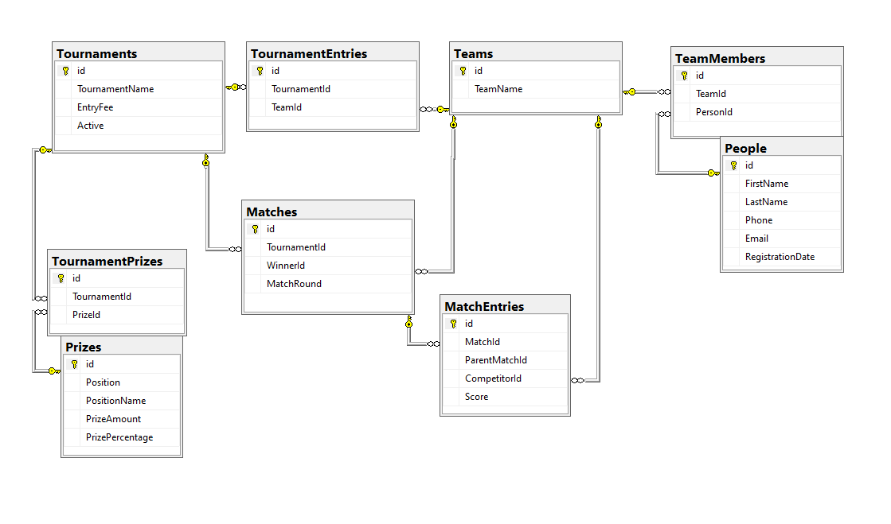

# Tournament Tracker
**Source : [C# Application from Start to Finish, freeCodeCamp tutorial](https://youtu.be/wfWxdh-_k_4)**

## Scenario
- Stakeholder requests to build a Tournament tracker using bracket tournament system where application decides the opponents in a single-elimination style. At the end, tournament winner is identified. 
- The tournament model is based on March Madness Seeding (Best v Worst in a division)

- 

	
<b>March Madness Seeding</b>

	<a href="https://en.wikipedia.org/wiki/Bracket_(tournament)">March Madness Seeding (Best v Worst in a division)</a>
	<ul>
	<li> Divisions are broken into pools (e.g., North, South, East, West) and within each pool teams are ranked. </li>
	<li> The top seed plays the worst seed, the second best seed plays the 2nd worst seed within the pool, etc., until all teams play their first round. </li>
	<li> If the pool has an odd (not divisible by 2) number of teams, there will be a "play in" game of the worst vs the 2nd worst team. Such a seeding system produces a wide variety of matches, but requires many games to determine an outcome. </li>
	</ul>

 

------
------

## Table Of Contents
- [PLAN](#plan)
	- [Requirements](#requirements)
	- [Questions](#questions)
- [Overview](#overview)
	- [Big Picture Design](#big-picture-design)
	- [Key Concepts to Learn](#key-concepts-to-learn)
- [DESIGN](#design)
	- [Map Data Relations](#map-data-relations)
	- [User Interface Design](#user-interface-design)
	- [Logic Plan-Wiring Frontend and Backend](#logic-plan-wiring-frontend-and-backend)
	- [SQL Database Design](#sql-database-design)
- [IMPLEMENTATION](#implementation)
	- [Wiring Prize Form to Backend](#wiring-prize-form-to-backend)
- [Personal Takeaways](#personal-takeaways)

--------
--------

 

## PLAN

### Requirements
- Identifying the opponents and the winner
- Multiple competitors
- Define which competitors are competing and when
- Schedule games (how to, needs more specifics)
- Single loss elimination
- Identify last competitor standing as winner

### Questions
1. What if there are uneven number of competitors ? 
	- *Randomly advance the odd competitor to next round, a.k.a "Byes"*
2. Is the total number of competitors fixed or variable ? 
	- *Variable*
3. Are the opponents chosen randomly or based on any key factors? 
	- *Random*
4. Are the games scheduled or played whenever possible ? 
	- *Whenever*
5. If played whenever, could/should we include a pre-round/qualifiers to directly move to round 2 ? 
	- *No. Consequential rounds*
6. Is there scoring or just the winner ? 
	- *Each player with a score as 1 or 0*
7. User interface - form or webpage or app ? (never assume!) 
	- *form for now, later website or app*
8. Data storage location ? 
	- *Microsoft SQL Server, also a text file backup*
9. Are the Payins to the game(entry fee) or Payouts to the competitors(prizes) handled or nothing at all ? 
	- *Yes, option to charge payins and payouts. Payout for top 3 teams as a percentage of the tournament income, but definetely the sum of payouts < tournament income*
10. Reporting type - results announced in detail or just brief? 
	- *Send Overall rounds outcomes, each competitor stats to admin and users*
11. Game results entered by whom ? 
	- *Anyone*
12. Levels of access - Admin, User ? 
	- *Single-User access. No varying levels, but competitors get only email reports and notifications,  admin only accesses form*
13. Notificaton to users about upcoming games ? 
	- *Yes, competitors are notified by email*
14. Tracker tracks Players and Teams or only Teams ? 
	- *Every member of the team must be tracked individually for game notifications and reports*

## Overview

### Big Picture Design
- **Structure** : Windows Forms application and Class Library
- **Data Storage** : SQL and/or Text File
- **Users** : One user at a time or single-user access

### Key Concepts to Learn
*NOTE : Always research the requirements to know what is lacking and to understand them*
- **Email** : How to send emails through application using C#
- **Custom Events** : How to identify end of rounds, report round outcomes and notify users about upcoming games
- **Error Handling** : How to handle possible erroneous user input
- **Interfaces** : What are they and How to use them
- **Random Ordering** : How to randomize opponents and choosing Byes
- **Texting** : *BONUS* How to capture key user information for notification purposes

 

## DESIGN

### Map Data Relations
- <i>ALWAYS build Pseudocode. 
- ALWAYS okay to miss some details.</i> 

- *Define Objects/Classes by identifying unique categories to record data*
	- <b>Person
	- Team
	- Tournament
	- Prize</b>
	- <b>Match</b> (in tutorial, <em>Matchup</em>)
	- <b>MatchRegistry</b> (in tutorial, <em>MatchupEntry</em>)

 

- *Map Relations between Objects/Classes*
	- <b>Person -> Team <-> Tournament
	- Tournament <- Prize
	- Tournament <- Match
	- Match <-> MatchRegistry <-> Team</b>

 

- *Define Object/Class structure*

<table align="center">
	<tr> 
		<th>Object/Class</th>
		<th>Property (<i>datatype</i>)</th>
	</tr>
	<tr>
	<td><b>Person</b></td>
		<td>
			<ul>
				<i>
				<li>FirstName (string)</li>
				<li>LastName (string)</li>
				<li>PhoneNumber (string)</li>
				<li>Email (string)</li>
				</i>
			</ul>
		</td>
	</tr>
	<tr>
		<td><b>Team</b></td>
		<td>
			<ul>
				<i>
				<li>Name (string)</li>
				<li>Members (List<<b>Person</b>>)</li>
				</i>
			</ul>
		</td>
	</tr>
	<tr>
		<td><b>Tournament</b></td>
		<td>
			<ul>
				<i>
				<li>Name (string)</li>
				<li>EntryFee (decimal) </li>
				<li>Teams (List<<b>Team</b>>)</li>
				<li>Match (List<<b>Match</b>>)</li>
				<li>Prizes (List<<b>Prizes</b>>)</li>
				<li>Rounds (List<<em>List<<b>Match</b>></em>)</li>
				</i>
			</ul>
		</td>
	</tr>
	<tr>
		<td><b>Prize</b></td>
		<td>
			<ul>
				<i>
					<li>Position (int)</li>
					<li>PositionName (string)</li>
					<li>PrizeAmount (decimal)</li>
					<li>PrizePercentage (double)</li>
				</i>
			</ul>
		</td>
	</tr>
	<tr>
		<td><b>Match</b></td>
		<td>
			<ul>
				<i>
				<li>Entries (List<<b>MatchRegistry</b>>)</li>
				<li>Winner (<b>Team</b>)</li>
				<li>MatchRound (int)</li>
				</i>
			</ul>
		</td>
	</tr>
	<tr>
		<td><b>MatchRegistry</b></td>
		<td>
			<ul>
				<i>
				<li>CompetingTeam (<b>Team</b>)
				<li>Score (int)</li>
				<li>ParentMatch (<b>Match</b>)</li>
				</i>
			</ul>
		</td>
	</tr>
</table>

 

### User Interface Design
- *RECOMMENDED : Lay down the most possible UI layout on paper*
- *Focus on UI layout only, Backend layout will be figured out later*
- Possible Forms to be designed and built as follows :
<table align="center">
	<th>Form</th>
	<th>Type</th>
	<th>Calling Form</th>
	<th>Function</th>
	<tr>
		<td>Tournament Dashboard</td>
		<td>Home Page/Main Form</td>
		<td>None</td>
		<td>Application - Start, End</td>
	</tr>
	<tr>
		<td>Tournament Viewer</td>
		<td>Pop Up Form</td>
		<td>Tournament Dashboard</td>
		<td>Load Tournament</td>
	</tr>
	<tr>
		<td>Create Tournament</td>
		<td>Pop Up Form</td>
		<td>Tournament Dashboard</td>
		<td>Create Tournament</td>
	</tr>
	<tr>
		<td>Create Team</td>
		<td>Pop Up Form</td>
		<td>Create Tournament</td>
		<td>Create/Add Team, Members</td>
	</tr>
	<tr>
		<td>Create Prize</td>
		<td>Pop Up Form</td>
		<td>Create Tournament</td>
		<td>Create Prize</td>
	</tr>
</table>

 

- <i>NOTE : 
	- Main Form or <b>Tournament Dashboard</b> must be open at the times for the application to be active
	- Main Form or <b>Tournament Dashboard</b> must be functionally detached from other Forms for the application to perform multiple tasks simultaneously, such as :
		- **Create Tournament** for an upcoming Tournament
		- Create/Add Teams to new Tournament
		- Create Prize for new Tournament
		- **Load Tournament** for viewing and updating status of an active Tournament on **Tournament Viewer**
</i> 

### Logic Plan - Wiring Frontend and Backend
- Evaluate <b>HOW</b> :
	- Forms are interconnected
	- Forms are navigated, back and forth
		- For example : In **Create Tournament**, to create a new team and for that team to show up in the Teams/Players section, an Interface will be required
	- Items from Dropdown lists,  such as Teams/Players and Prizes, are displayed :
		- Removed after selection
		- Added after deletion from display sections 
		- Shown in the related display sections
	- Fields with required text values cannot be empty
	- Fields with decimal values cannot be negative
	- <b>Create XYZ </b> Form button - determines the Logic to randomize Teams into Rounds and Byes
	- Post completing Form **function**, Form closes returns to **Calling Form**
	- Information related to **Tournament Viewer** :
		- Tournament Name
		- Current Round and Rounds completed
		- Matches played and unplayed
		- Scoring only for current Round Matches
		- Email notifications on submitting scores
	- Data storage and access
	- Trigger for updating current Match outcomes and next Match details

### SQL Database Design
- **SQL Server Developer Edition 2022** - includes all enterprise features except for a production environment
- **SSMS (SQL Server Management Studio)** - GUI for managing databases, tables, relationships and connections
- **Database Design built using SSMS** :

- **Stored Procedures** :
	- Secure protocols to minimze SQL-Injection hacking attempts
	- Used to display data from Database tables in the application through simple query results

 

## IMPLEMENTATION

### Wiring Prize Form to Backend
- Build Pseudocode :
	- How to validate incoming data ?
		- *verify if they are in the required format* 
	- How to save the received data ? 
		- *create methods to save data to SQL Database and Text file*
	- How to connect to SQL Database ?
		- *Use the connection string in a Global Static Class*
	- Where to store the incoming data ?
		- *SQL Database or Text file or both*
	- How to save the received data to both data storage points ?
		- *By using an Interface - which functions as a contract*
		
		

			
<b>What is an Interface ?</b>

			<ul>
			<li>In simple terms, it is a calling card for structurally and functionally different classes under one umbrella</li>
			<li>For Example: Let us consider health care costs in a family with adults, children and pets. Each category has their own issues but expenses would be paid with the same money.</li>
			<li>Above example can be expressed in an Interface as : 

		<code>

				// Health Record
				class HealthInfo
				{
					// properties
				}
				
				// Interfaces for health information and expenses
				public interface IHealthCare 
				{
					double GetHealthExpenses();
				}
				
				public interface IHealthInfo
				{
					List<HealthInfo> GetHealthInfo();
				}
		</code>
			<li>In the above Interface, an abstract method (method without implementation) is defined.</li>
			<li>If a Class or Struct implements the Interface <code>IHealthCare</code>, it must define the method implementation of the interface member</li>
			<li>In our example, above it is defined as follows :</li>			
		
		<code>
				
				// Adult Healthcare
				class AdultHealthCare : IHealthCare
				{
					public List<HealthInfo> GetHealthInfo()
					{
						// code
					}
					
					public double GetHealthExpenses()
					{
						// code
					}
				}
				
				// Pet Healthcare
				class PetHealthCare : IHealthCare
				{
					public List<HealthInfo> GetHealthInfo()
					{
						// code
					}
					
					public double GetHealthExpenses()
					{
						// code
					}
				}
		
		</code>
			<li>In the above example, since the categories differ their health expense calculation also differs. Hence, a full-abstract class/Interface supports building multiple Inheritance to better connect these categories.</li>

		

	- 

## Personal Takeaways
- *To figure out when to choose what kind of project model in Visual Studio. For example : How did we know to chose ClassLibrary Model for this particular project ?*
- *Solution is built from the project. Hence, name of the product to be created should be signified in the Solution name.*

